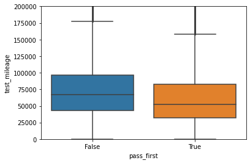
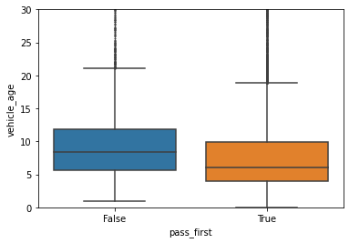
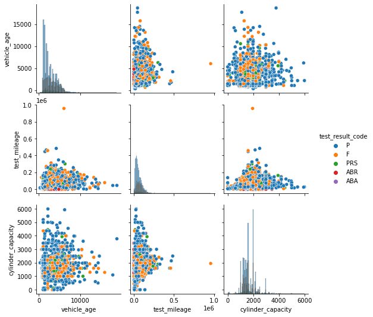

# Gov.uk MOT data analysis

## Exec summary
- Built a local SQLite database over 3Gb and 37mil records.
- Cleaned and filtered dataset down to "G" postcode, Class 4 vehicles, and 2019 test records.
- Performed exploratory analysis 
  - Top vehicle brands: **Vauxhall, Ford, VW, Renault, Audi**.
  - Typical annual mileage: **10,000 mi**
- Trained a classifier using Stochastic Gradient Descent to predict pass/fail with **accuracy of 76%** using only 2 continuous input features (vehicle_age, test_mileage).

## Data source
"MOT testing data results (2019)" from (https://data.gov.uk/dataset/e3939ef8-30c7-4ca8-9c7c-ad9475cc9b2f/anonymised-mot-tests-and-results)

## Notebooks
*datagathering.ipynb:* Data downloaded to my laptop from GOV.uk. Read in csv's and combined into one large locally stored SQLite database, 3Gb and 37mil rows. 
([Open notebook in colab](https://githubtocolab.com/adin786/mot-data/blob/main/datagathering.ipynb))

*eda.ipynb:* Early exploratory analysis was kept simplistic at this stage, due to size of dataset.  A subset for data was filtered down to Glasgow "G" postcode only, and 2019 records only.  This was saved to my google drive to keep a tidy workflow so I could run in Google Colab.  I will probably combine this into the above datagathering.ipynb. ([Open notebook in colab](https://githubtocolab.com/adin786/mot-data/blob/main/eda.ipynb))

\****mot_analysis.ipynb:***\* This notebook contains the bulk of the exploratory analysis and model building code. ([Open notebook in colab](https://githubtocolab.com/adin786/mot-data/blob/main/mot_analysis.ipynb))

## Highlights
*Note plots are from "G" postcode and 2019 records only*

### Histogram of vehicle ages
- Repeating peak just before each 1yr mark. Starts from 3yrs old.
- Makes sense as MOT test is required annually, and starts being required from 3yrs old. 

### Table of tests
- Most owners tend to get their vehicle tested in the last month before the deadline.
- 7.6% of vehicles' first MOT tests were done in the last month before the test was due. 

|Vehicle age at time of MOT test|% of tests|
|-----|----|
|Under than 2yrs 11months|2.6%|
|Between 2years 11months to 3years|7.9%|
|Between 3 years to 3years 1month|1.8%|

### Histogram of vehicle test_mileage
- Normal distribution with peak around 30k miles. 
- This makes sense in the context of the large number of tests near the 3yr vehicle "birthday".
- Suggests that most vehicles probably do around 10k miles per year, reaching 30k when 3yrs old.

### Box plot of vehicle age and mileage
- There is a distinguishable difference in the distribution of mileage and age for test passes compared to test fails.
- Suggests these 2 features will be useful in predictive modelling.

### Scatter plot grid of mileage vs age by test result
- Really just visualises the above in 2 dimensions.

### Scatter plot grid dividing the above plot by vehicle make
- There is *some* visible relationship between vehicle_age vs test_mileage
- The relationship appears to be distonguishable between different vehicle makes (e.g. compare Audi vs Ford)
- Vehicle "make" may therefore be useful feature for predictive modelling.

### Scatter (pair) plot over all continuous features

